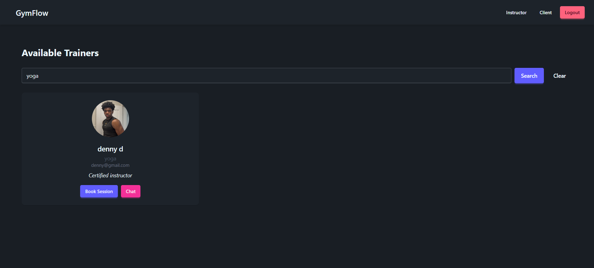
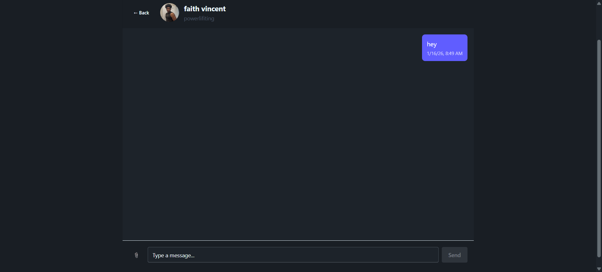

# 🏋️ GymFlow

GymFlow is a **full-stack gym management and booking platform** built with **Angular** (frontend) and **ASP.NET Core Web API** (backend).

The application supports **Admins**, **Instructors**, and **Clients**, enabling trainer discovery, availability scheduling, slot-based bookings, and direct messaging.

This project demonstrates **real-world full-stack development**, secure API design, and clean application architecture.

---

## 📸 Screenshots

### Trainer Search & Browse



### Booking & Availability


### Instructor Dashboard


### Chat System



---

## 🚀 Core Features

### 🔐 Authentication & Authorization

* JWT authentication (access & refresh tokens)
* Role-based authorization (Admin / Instructor / Client)
* Angular route guards
* Claims-based identity management

---

### 🧑‍🏫 Instructor

* Profile management (bio, specialty, image upload)
* Weekly availability creation using **DayOfWeek + TimeSpan**
* Backend prevention of overlapping availability
* Automatic generation of **30-minute booking slots**
* View assigned clients and bookings
* Cancel bookings

---

### 🧍 Client

* Browse and search trainers
* View instructor profiles and availability
* Book available time slots
* Already-booked slots disabled
* Booking confirmation modal
* Dark-mode friendly UI

---

### 🛠 Admin

* Promote users to Instructor role
* Secure admin-only endpoints

---

### 💬 Chat

* One-to-one messaging (Client ↔ Instructor)
* Unread message count per user
* Notification badge for unread messages
* Supports text and image messages
* REST-based (ready for SignalR upgrade)

---

## 🧱 Tech Stack

### Frontend

* Angular (Standalone Components)
* TypeScript
* Tailwind CSS + DaisyUI
* REST API services
* Toast notifications and modals

### Backend

* ASP.NET Core Web API
* Entity Framework Core
* SQL Server
* JWT Authentication
* Role-based authorization
* Swagger API documentation
* Static file hosting (`wwwroot/uploads`)

---

## 📂 Project Structure

```
GymFlow/
├── gym-app/          # Angular frontend
├── GymflowBackend/   # ASP.NET Core backend
├── screenshots/      # README images
└── README.md
```

---

## 🧠 Booking Logic

* Instructors define weekly availability
* Backend prevents overlapping schedules
* Availability converted into **30-minute slots**
* Backend enforces **no double booking**
* Bookings store exact start and end times

---

## ▶️ Run Locally

### Backend

1. Configure SQL Server connection string
2. Run Entity Framework migrations
3. Start the API
4. Open Swagger at `/swagger`

### Frontend

1. Navigate to `gym-app`
2. Install dependencies
3. Start Angular dev server
4. Open the app in the browser

---

## 📌 Resume Highlights

* Built a full-stack Angular + ASP.NET Core application
* Implemented secure JWT authentication with refresh tokens
* Designed role-based dashboards and APIs
* Developed conflict-free slot-based booking system
* Created REST-based chat with unread message tracking
* Integrated image uploads and static file hosting

---

## 🔮 Future Improvements

* Real-time chat using SignalR
* Calendar-based booking UI
* Admin analytics dashboard
* Email notifications
* Payment integration

---

## 👤 Author

**Emmanuel Vincent**
Computer Science Student | Full-Stack Developer

GitHub: [https://github.com/nerovincent]
